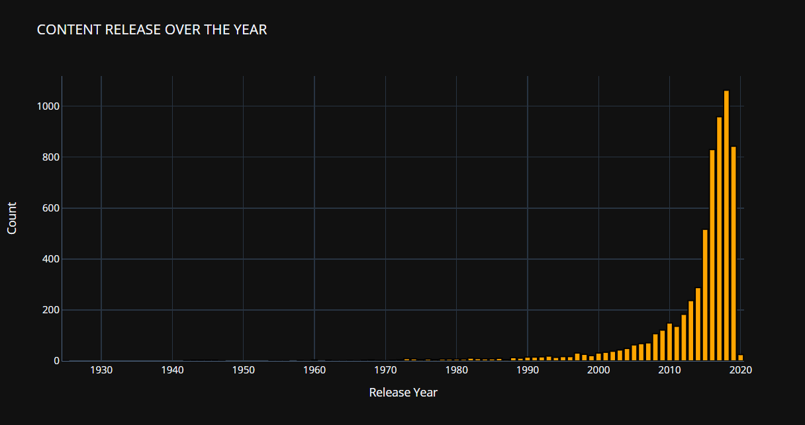
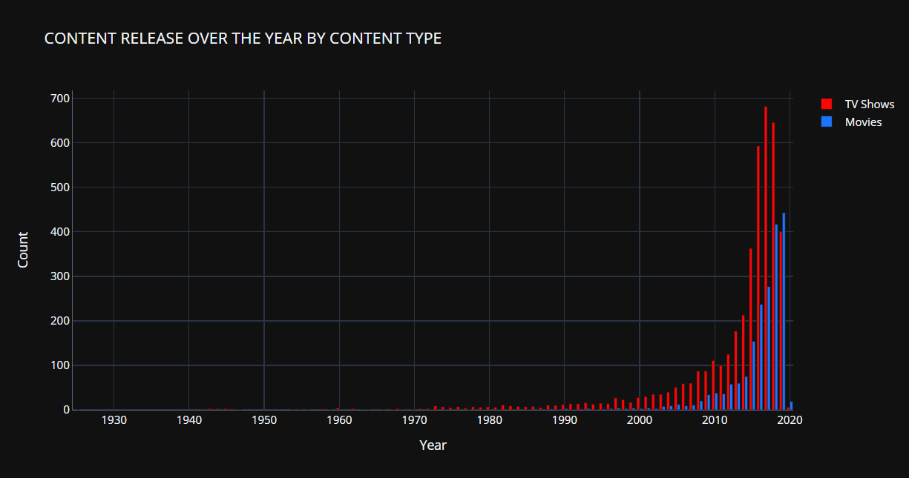
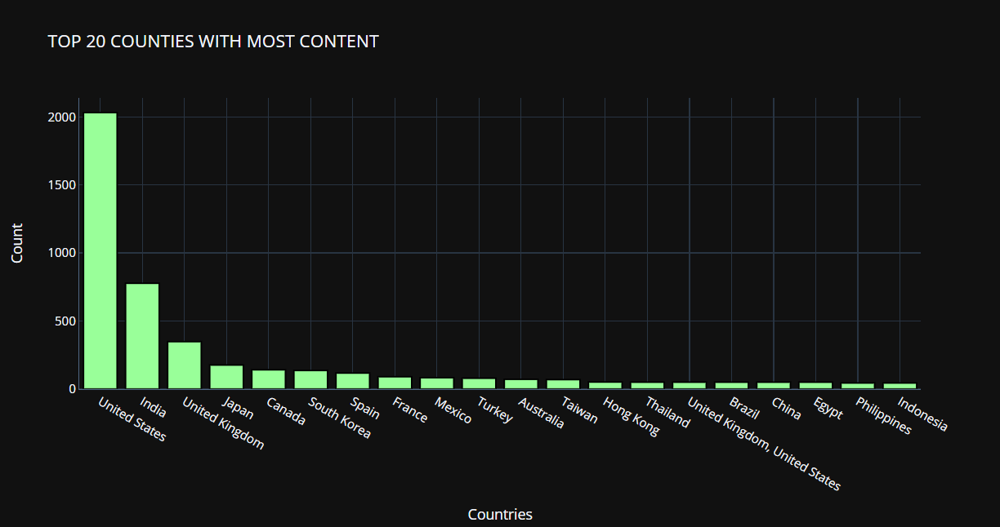
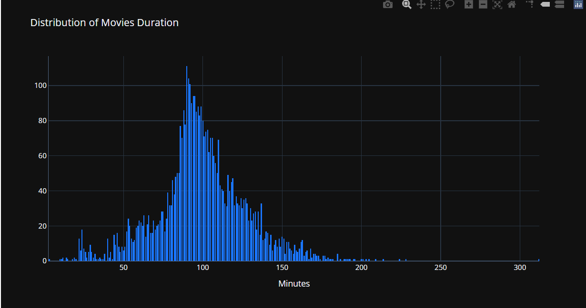
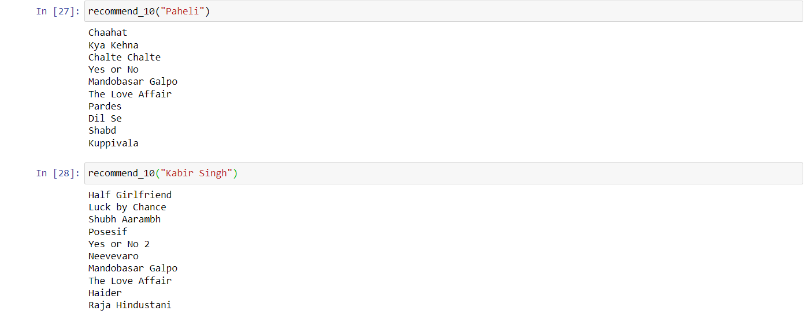

# Movie-Recommendation

Goal was to use NLP to make a content-based recommendation system which shows 10 most related movies/TV shows to the movie you entered.

Dataset used contains approx 6000 entries of different movies released from 1925-2020 but added to neflix in the period 2008-2020.

## Did Exploaratory data analysis on the Dataset - 

## Recommendation system - 

Used Count Vectorizer and Cosine similarity to find 10 most related movies to any movie in this dataset.

